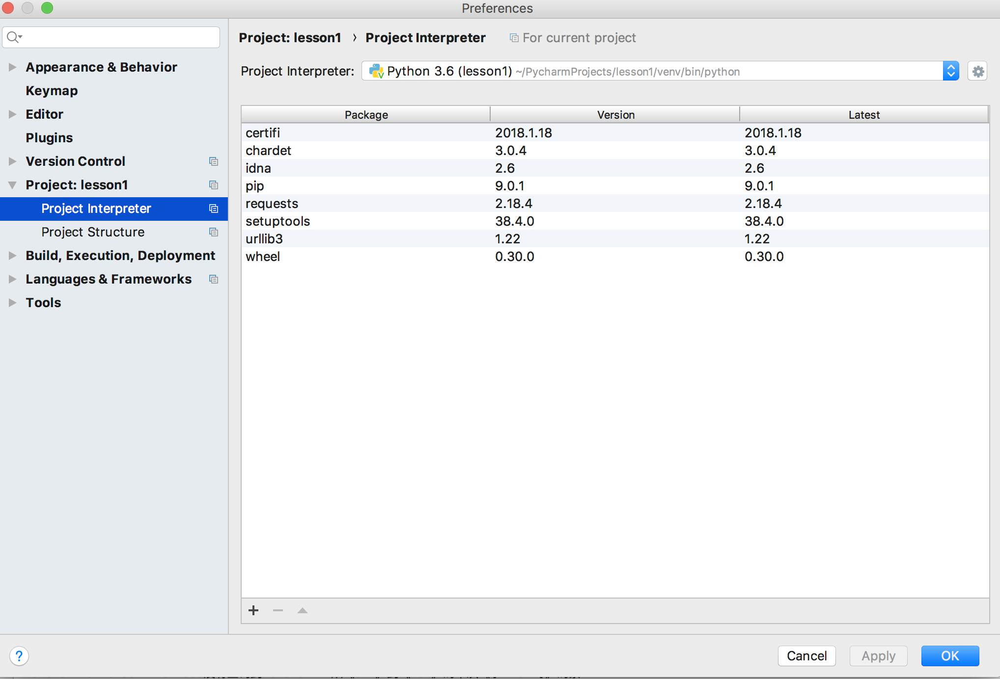

# lesson1
这是基于Python3写的一些示例

# 安装
## Mac
brew install python3

* 克隆项目并配置
在pycharm中Git克隆该项目后，进入项目，按Comand+,进入项目（开发工具）配置，在《Project：项目名》下《Project Interpreter》进行环境配置。
配置后类似于图：

* 安装其他组件
pip3 install requests